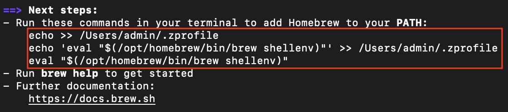
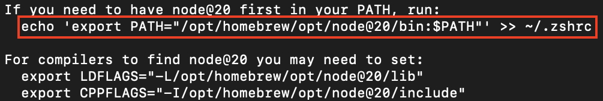

This python script downloads, builds, and installs Open Stage Control on Apple Silicon Macs.

## Instructions

1. [Install Homebrew](https://brew.sh/). Be sure to follow the instructions that appear at the end of the installation process. At the time of writing, they look like this:

    

> [!NOTE]
>
> Your username may be different than `admin`.

2. A window requesting you to install the Xcode Command Line Tools may appear. If so, click `Install`. Once the installation is finished, repeat steps 2 and 3.

  

> [!NOTE]
>
> You will only have to install the Xcode Command Line Tools once -- subsequent executions of this script will skip this step.

3. Install node: `brew install node@20`. Once again, be sure to follow the instructions that appear at the end of the installation process. At the time of writing, they look like this:

    

4. Download this repo or the [individual Python file](<./Open Stage Control - Apple Silicon installer.py>).
5. Open a new Terminal window and navigate to where you downloaded the aforementioned Python file.

> [!NOTE]
>
> If you're unsure how to do this, follow the instructions on [this page](https://support.apple.com/guide/terminal/open-new-terminal-windows-and-tabs-trmlb20c7888/mac) under the section titled `Open new Terminal windows or tabs from the Finder`.

6. Type `python3 Open Stage Control - Apple Silicon installer.py`

7. A terminal window will appear -- wait for it to say that the process has completed, and then navigate to `/Applications/Open Stage Control` to run the newly-built app.
